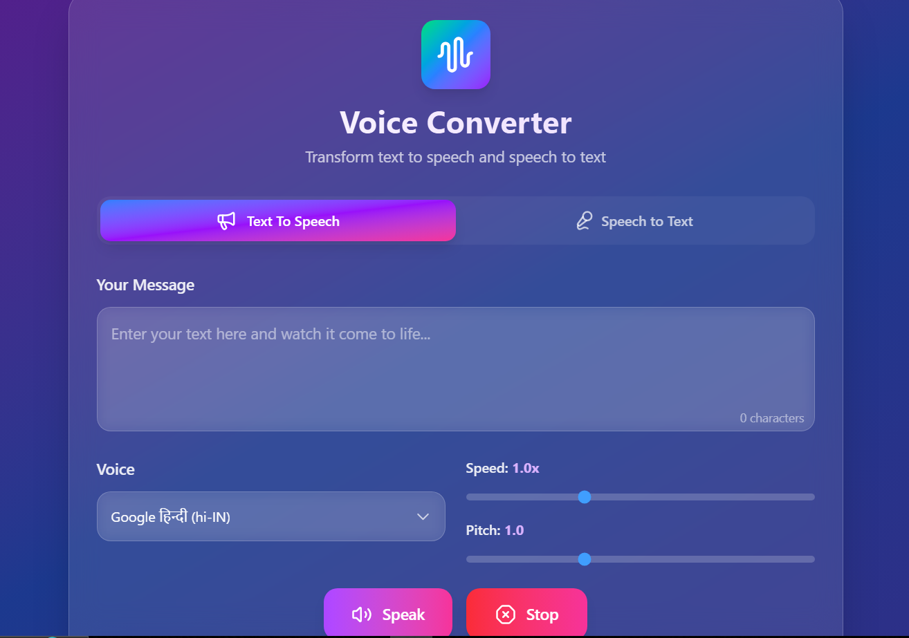
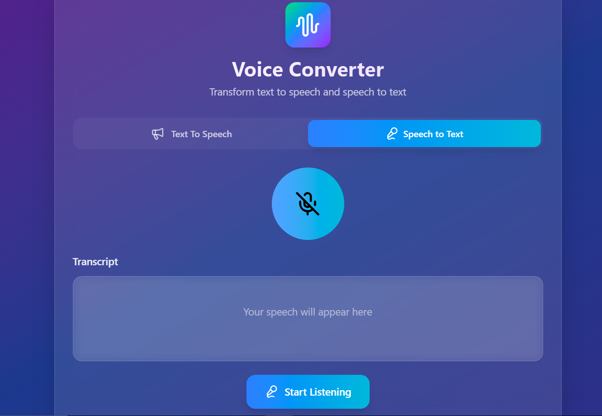

# Voice Converter 🎙️

A modern, responsive web application that provides both Text-to-Speech (TTS) and Speech-to-Text (STT) functionality using the Web Speech API. Built with React and styled with Tailwind CSS for a beautiful, glassmorphic interface.

## 🎬 Demo

### Live Demo
🌐 **[Try Voice Converter Live](https://voice-converter-one.vercel.app/)**

Experience the full functionality of Voice Converter directly in your browser. The demo includes:
- Real-time text-to-speech conversion with voice selection
- Live speech recognition with instant transcription
- Interactive controls for speed and pitch adjustment
- Responsive design showcase across devices


## 📸 Screenshots

### Text-to-Speech Interface

*Clean, intuitive interface for converting text to speech with voice controls*

### Speech-to-Text Interface  

*Real-time speech recognition with live transcription display*  


## ✨ Features

### 🔊 Text-to-Speech (TTS)
- Convert any text to natural-sounding speech
- Choose from multiple voices and languages
- Adjustable speech rate (0.5x - 2.0x)
- Adjustable pitch (0.5 - 2.0)
- Real-time speaking status with visual feedback
- Clean, modern interface with gradient buttons

### 🎤 Speech-to-Text (STT)
- Real-time speech recognition
- Continuous listening with interim results
- Copy transcribed text to clipboard
- Clear transcript functionality
- Visual microphone status indicator
- Browser compatibility detection

### 🎨 Design Features
- Modern glassmorphic design
- Gradient backgrounds and buttons
- Smooth animations and hover effects
- Responsive layout for all devices
- Dark theme with purple/blue color scheme
- Accessible UI with proper contrast

## 🚀 Getting Started

### Prerequisites
- Node.js (v14 or higher)
- npm or yarn
- A modern web browser (Chrome, Edge, Safari recommended)

### Installation

1. Clone the repository:
```bash
git clone <your-repo-url>
cd speakflow-stt-tts
```

2. Install dependencies:
```bash
npm install
```

3. Start the development server:
```bash
npm run dev
```

4. Open your browser and navigate to `http://localhost:5173`

## 🛠️ Available Scripts

- `npm run dev` - Start development server
- `npm run build` - Build for production
- `npm run lint` - Run ESLint
- `npm run preview` - Preview production build

## 📁 Project Structure

```
speakflow-stt-tts/
├── public/
│   └── vite.svg
├── src/
│   ├── components/
│   │   ├── STT.jsx          # Speech-to-Text component
│   │   └── TTS.jsx          # Text-to-Speech component
│   ├── assets/
│   │   └── react.svg
│   ├── App.jsx              # Main application component
│   ├── main.jsx             # Application entry point
│   └── index.css            # Tailwind CSS imports
├── package.json
└── README.md
```

## 🎯 How to Use

### Text-to-Speech
1. Switch to the "Text To Speech" tab
2. Enter your text in the message field
3. Select a voice from the dropdown menu
4. Adjust speed and pitch using the sliders
5. Click "Speak" to hear your text
6. Use "Stop" to halt speech at any time

### Speech-to-Text
1. Switch to the "Speech to Text" tab
2. Click "Start Listening" to begin speech recognition
3. Speak clearly into your microphone
4. Watch your words appear in real-time
5. Click "Stop Listening" when finished
6. Use "Copy" to copy the transcript or "Clear" to reset

## 🌐 Browser Compatibility

### Text-to-Speech
- ✅ Chrome/Chromium (Recommended)
- ✅ Firefox
- ✅ Safari
- ✅ Edge

### Speech-to-Text
- ✅ Chrome/Chromium (Best experience)
- ✅ Edge
- ✅ Safari (Limited support)
- ❌ Firefox (Not supported)

## 🔧 Technologies Used

- **React 19** - UI library
- **Vite** - Build tool and dev server
- **Tailwind CSS 4** - Utility-first CSS framework
- **Lucide React** - Beautiful icons
- **Web Speech API** - Browser speech synthesis and recognition
- **ESLint** - Code linting

## 🙏 Credits

This application is powered by the **Web Speech API**, a browser-based API that provides speech recognition and speech synthesis capabilities. Special thanks to the web standards community and browser vendors for making these powerful voice technologies accessible to developers.

- **SpeechSynthesis API** - Enables text-to-speech functionality
- **SpeechRecognition API** - Enables speech-to-text functionality

## 🎨 Styling

The application uses Tailwind CSS with a custom design featuring:
- Glassmorphic cards with backdrop blur
- Gradient backgrounds and buttons
- Smooth hover animations
- Responsive grid layouts
- Modern color palette (purple, blue, cyan gradients)

## 🔒 Privacy & Security

- No data is sent to external servers
- All speech processing happens locally in your browser
- Microphone access requires user permission
- No personal data is stored or transmitted

## ⚠️ Known Limitations

- Speech recognition requires an active internet connection in some browsers
- Voice quality and availability depend on your operating system
- Speech recognition accuracy varies with background noise
- Some browsers may have voice loading delays

## 🤝 Contributing

1. Fork the repository
2. Create a feature branch (`git checkout -b feature/amazing-feature`)
3. Commit your changes (`git commit -m 'Add amazing feature'`)
4. Push to the branch (`git push origin feature/amazing-feature`)
5. Open a Pull Request

## 📝 License

This project is private and not currently licensed for public use.

## 🐛 Troubleshooting

### Speech Recognition Not Working
- Ensure you're using a supported browser (Chrome recommended)
- Check that microphone permissions are granted
- Verify your microphone is working in other applications
- Try refreshing the page

### No Voices Available
- Wait a moment for voices to load
- Refresh the page if voices don't appear
- Check your system's text-to-speech settings

### Audio Not Playing
- Check your system volume
- Ensure the selected voice is compatible
- Try a different voice from the dropdown

## 🔮 Future Enhancements

- [ ] Audio file export functionality
- [ ] Multiple language support for STT
- [ ] Voice effects and filters
- [ ] Batch text processing
- [ ] Custom voice training
- [ ] Offline functionality
- [ ] Mobile app version

---

**Built with ❤️ By Shubham Raj**